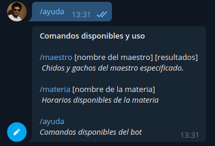

# maestros-telegram-bot
Web scraper bot de Telegram que saca información de maestros y materias de http://horarios.fime.me y http://listademaestros.com.

## Acceso
Se puede acceder al bot directamente desde http://t.me/ListaDeMaestrosBot o bien, buscando @ListaDeMaestrosBot dentro de la app de Telegram.

## Comandos
`/maestro <nombre-maestro> <opcional: numero-resultados>`, regresa "Chidos" y "Gachos" de los maestros con ese nombre/apellido.

**Ejemplo de uso**

`/materia <nombre-materia>`, regresa horarios disponibles de la materia indicada.

`/ayuda`, Comandos disponibles del bot.
